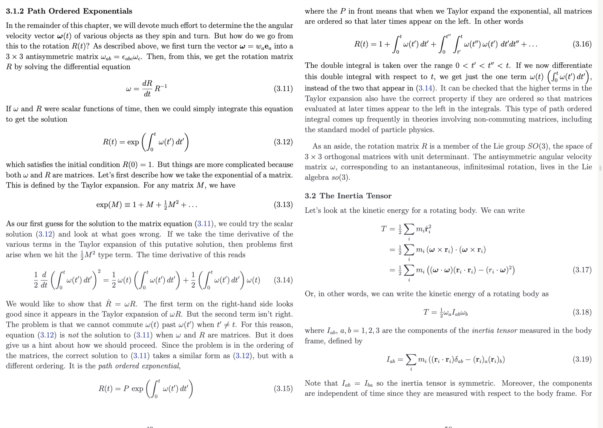
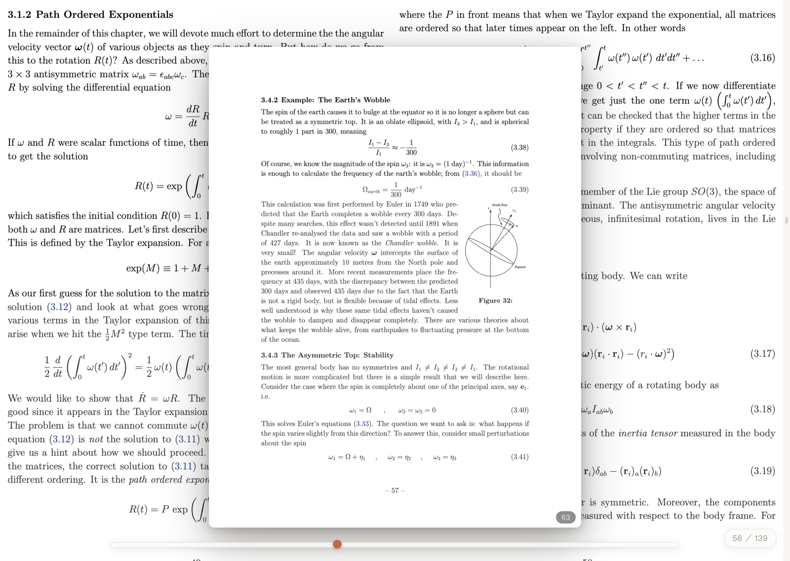
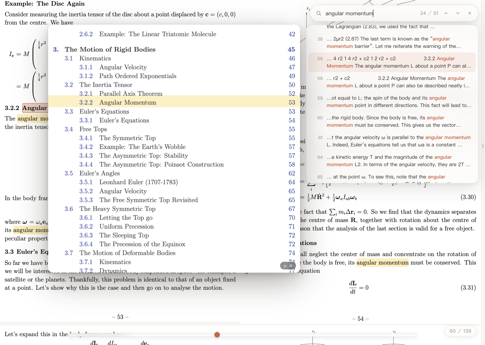
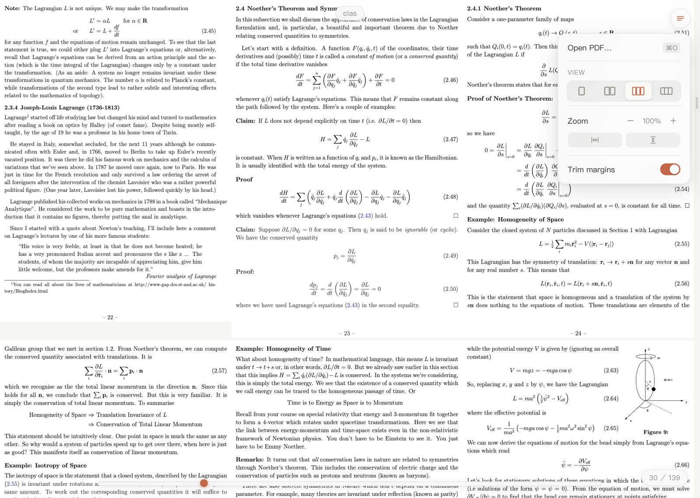
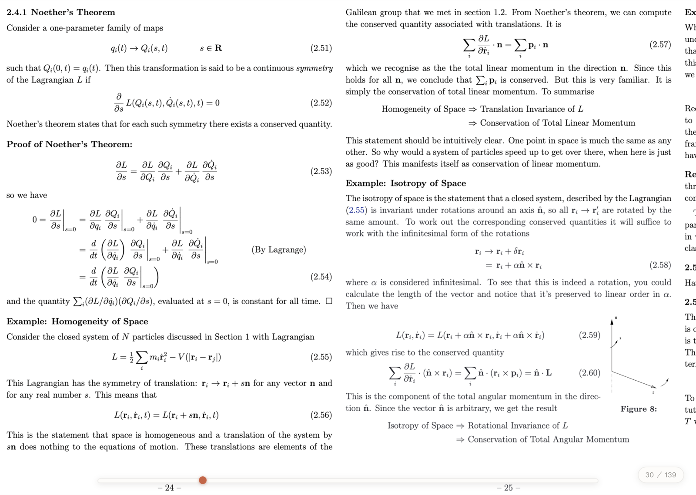

<p align="center">
  
</p>

<p align="center"><a href="README.md">English</a> | 简体中文</p>

<h1 align="center">Riffle · 翻书</h1>

<p align="center">
  <em>为科研文献打造的极简 macOS PDF 阅读器。</em><br/>
  整个窗口就是纸面——所有控件只在鼠标靠近时浮现。
</p>



## 为什么是 Riffle

读文献意味着不停地跳转：看引用、看图表、翻到下一节、再跳回来。多数阅读器
让你为每次跳转付出代价。Riffle 的哲学是**先瞥一眼，再决定跳不跳**——
处处可预览，点击才跳转。

## 速览滑杆——名字的由来

> *riffle（动词）：用拇指快速哗哗地翻一本书。*

这是 Riffle 的核心。鼠标移到窗口底缘，一条细长的尺子浮现：整本文档铺成
一条线，章节起点如分度线般蚀刻在尺身里，一枚朱砂圆点标记你的当前位置。

**沿着尺子扫过，页面像手翻书一样哗哗掠过**——拇指之下的每一页都是全尺寸
可读的预览，两侧还带着相邻页。悬停不会带走你的阅读位置，点击才真正跳转。
跳走之后，出发的地方会在轨道上留下一枚慢慢褪色的朱砂残影——最近两次
跳转的来路，永远一击即返。



## 处处可预览

- **链接预览** —— 点击文内链接（引用、图表参照），目标区域的可读预览
  原地浮现，窗内可以滚动、可以捏合缩放——值得再跳过去。
- **懂论文的搜索** —— 行尾连字符断词（`meth-` / `od`）拼合为一个词、
  变音符号归一化、容忍 PDF 文本流丢失的空格；结果带上下文片段，
  悬停浮出该页预览，柠檬黄高亮带精确压在匹配那一行上。



## 阅读模式

单栏、双栏、三栏无缝拼接，或页面边贴边的横向胶片模式（竖直滚轮自动变为
横向滚动）。页面铺满窗口、没有任何常驻界面；自动裁白边把页边距让给内容。

| 三栏 + 菜单 | 横向胶片 |
|---|---|
|  |  |

## 其余种种

- **批注** —— 真正的荧光笔（multiply 混色，文字保持锐利），五种颜色；
  可拖动换位的便签；完整的 **⌘Z / ⇧⌘Z 撤销重做**；没写字的便签会自己消失
- **指针锚定缩放** —— 双指捏合围绕光标缩放，手势停下才重渲染锐化；
  适宽 / 适高一键匹配
- **目录** —— 鼠标移到左缘自动展开，阅读时当前章节实时标记
- **文稿架** —— 鼠标移到右缘展开（快捷键 `D`）；拖进窗口的每个 PDF 都成为
  一张卡片，像桌面上的纸一样自由拖放排布；点击卡片即刻切换文档，`⌃Tab`
  在最近两篇之间往返；悬停卡片可翻选封面页、固定 📌、或在新窗口打开；
  卡片底部一条细线显示阅读进度；三天未碰的文稿淡为灰色，七天未碰且未
  固定的自动离架（只清条目，磁盘上的文件绝不动）
- **多窗口** —— ⌘N 或 Dock 图标右键"新建窗口"开新工作区；每个窗口的
  文稿架相互独立，同一窗口内可同时打开多个文档（⌘O 多选、访达打开、
  拖拽均可）
- **按文档记忆** —— 浏览模式、缩放、裁边、阅读位置、批注全部按文件记住
- **双语界面** —— 随系统语言自动切换中文 / English
- 亮暗色随系统、红绿灯靠近才现身、空白处抓手平移、
  阅读快捷键（`←` `→` 翻页、空格滚屏、`Home` / `End` 首尾）

## 安装

从 [Releases](../../releases) 下载最新的 `Riffle-x.y.z-arm64.dmg`，
打开后把 **Riffle** 拖进「应用程序」。

> **首次启动** —— Riffle 未经 Apple 公证（需要 $99/年 的开发者账号），
> 下载后 macOS 会隔离应用并谎称其"已损坏"。它没坏——拖入「应用程序」后
> 在终端执行一次即可解除隔离：
>
> ```bash
> xattr -cr /Applications/Riffle.app
> ```
>
> 此后一切正常。需要 Apple Silicon 芯片的 Mac。

## 从源码构建

```bash
npm install
npm start                # 开发模式运行
./tools/build-local.sh   # 打包 DMG（构建在本地磁盘进行）
```

技术栈：Electron + [pdf.js](https://mozilla.github.io/pdf.js/)。
设计原则与完整决策记录见 [DESIGN.md](DESIGN.md)。

## 许可

[MIT](LICENSE)
